# Evolutionary Discovery of Reinforcement Learning Algorithms via Large Language Models

[](media/Designing_and_Evolving_New_Reinforcement_Learning_Algorithms_using_Large_Language_models%20%284%29.pdf)
[](https://doi.org/10.1145/3795095.3805180)
[](https://www.python.org/)

Official repository for:

> **Evolutionary Discovery of Reinforcement Learning Algorithms via Large Language Models**  
> Alkis Sygkounas, Amy Loutfi, and Andreas Persson  
> Genetic and Evolutionary Computation Conference — GECCO 2026

This work searches directly over **executable reinforcement-learning update rules**.

Each candidate is a complete training procedure represented as Python code. Large language models generate structural variations of these procedures, while complete reinforcement-learning training runs provide the fitness signal.

The framework extends [REvolve, ICLR 2025](https://openreview.net/forum?id=cJPUpL8mOw) from evolving reward functions to evolving reinforcement-learning algorithms.

---

## Framework overview

[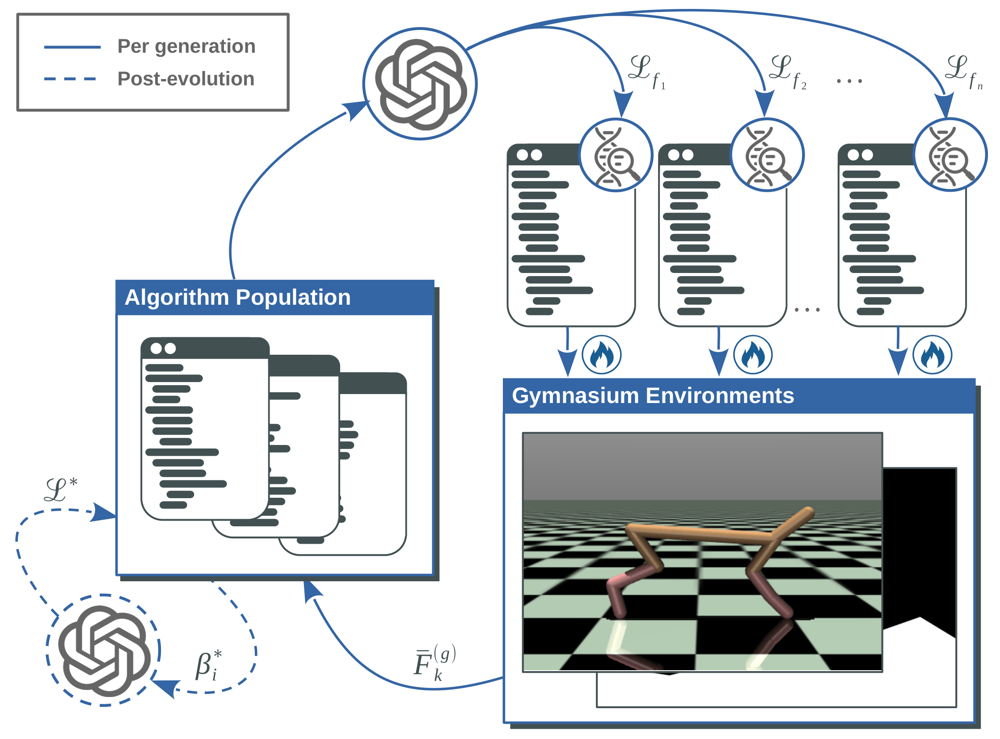](media/framework_overview_rl.pdf)

The policy architecture, optimizer, rollout procedure, and training budget are fixed across candidates. Evolution therefore changes the **learning logic**, rather than the policy-network capacity or optimizer.

Each candidate update rule is evaluated through complete reinforcement-learning training and receives an aggregated fitness score.

---

## LLM-guided variation

The language model acts as a generative variation operator through two mechanisms.

### Macro mutation

Macro mutation rewrites one semantically coherent component of an update rule, such as:

- an auxiliary learning objective;
- a planning mechanism;
- an exploration mechanism;
- a model-learning component;
- a stabilization mechanism.

Unlike small token-level mutations, macro mutation can repair or replace complete parts of the training procedure.

### Diversity-aware crossover

Crossover combines mechanisms from two parent update rules.

Both parents are selected from the same island population.

Parent 1 is sampled according to fitness. After parent 1 has been selected, every existing individual in that island is considered as a possible second parent.

The score for each possible second parent is:

```math
S(f_2 \mid f_1)
=
\alpha F(f_2)
+
(1-\alpha)d_{\mathrm{lev}}(f_1,f_2)
```

where:

- `F(f₂)` is the fitness of the possible second parent;
- `d_lev(f₁, f₂)` is the normalized Levenshtein distance between the source code of the two `compute_loss` functions;
- `α` controls the trade-off between fitness and structural dissimilarity.

The score is converted into a sampling probability using a softmax:

```math
P(f_2 \mid f_1)
=
\frac{
\exp\left(\tau S(f_2 \mid f_1)\right)
}{
\sum_{f \in P_k^{(g)}}
\exp\left(\tau S(f \mid f_1)\right)
}
```

Therefore:

- `α = 1` uses only fitness;
- `α = 0` uses only source-code dissimilarity;
- intermediate values balance performance and diversity.

This reduces crossover between near-duplicate algorithms while preserving selection pressure toward high-performing parents.

### Constrained generation

During evolutionary generation, the prompts prohibit explicit use of canonical reinforcement-learning mechanisms, including:

- actor–critic decomposition;
- temporal-difference updates;
- bootstrapped value targets.

These constraints discourage the language model from simply recreating PPO, DQN, SAC, or closely related update rules.

---

## Evolutionary fitness

Each candidate update rule is trained on five Gymnasium environments:

- CartPole-v1
- LunarLander-v3
- MountainCar-v0
- Acrobot-v1
- HalfCheetah-v5

Each environment is evaluated with five independent random seeds.

**5 environments × 5 seeds = 25 complete training runs per candidate.**

For each environment:

1. The policy is periodically evaluated during training.
2. The maximum evaluation return reached by each seed is retained.
3. The five seed-level maximum returns are averaged.
4. The resulting score is normalized using fixed environment-specific bounds.

The final evolutionary fitness is the mean normalized score across the five environments:

```math
F(f)
=
\frac{1}{N}
\sum_{i=1}^{N}
\widetilde{F}_i(f)
```

A newly generated candidate is accepted when its fitness is at least the mean fitness of its island.

Accepted candidates replace the lowest-fitness individuals while keeping the island population size fixed.

---

## Post-evolution refinement

Reinforcement-learning update rules can be highly sensitive to their internal scalar parameters. A promising update-rule structure may therefore appear weak when evaluated using only one parameter configuration.

After evolutionary convergence, the selected update rules undergo **LLM-guided hyperparameter optimization (LLM-HPO)**.

The procedure is:

1. The LLM receives the complete update-rule implementation and the environment specifications.
2. It proposes a bounded numeric interval for each internal scalar parameter.
3. Complete hyperparameter configurations are sampled uniformly from the resulting search region.
4. Every sampled configuration is evaluated using the same multi-environment fitness protocol.
5. The highest-performing configuration is retained for final evaluation.

The update-rule structure remains fixed during this stage. Only its internal scalar coefficients are refined.

```math
\beta_i^\star
=
\arg\max_{\beta}
F\left(f_{\beta}\right)
```

---

## Evolved algorithms

The two highest-performing update rules were obtained from two independent GPT-5.2 evolutionary runs.

The names below follow the terminology used in the paper. Some released code comments may retain earlier working titles.

### CG-FPD

**Confidence-Guided Forward Policy Distillation**

CG-FPD learns a compact world model in the policy's latent feature space.

It generates short candidate action sequences and uses the learned model to predict their latent-state, reward, and termination outcomes. Sequences are preferred when they are predicted to produce higher reward and avoid episode termination.

For continuous action spaces, the **Cross-Entropy Method (CEM)** repeatedly shifts the action-sequence sampling distribution toward higher-scoring sequences.

The first actions of the higher-scoring sequences are combined into a training target for the policy. This implements **planning-to-policy distillation**:

- the model-based planner acts as the teacher;
- the policy learns to reproduce the teacher's recommended action;
- planning is required only during training;
- execution requires only one policy forward pass.

The planner therefore improves the policy without being used online when the trained agent interacts with the environment.

### DF-CWP-CP

**Differentiable Forward Confidence-Weighted Planning with Controllability Prior**

DF-CWP-CP learns an observation-space world model that predicts:

- the next-state change;
- the immediate reward;
- the probability of episode termination.

Separate confidence models estimate the reliability of the dynamics, reward, and termination predictions.

The current policy is rolled forward through three imagined transitions. The predicted reward-and-survival score is confidence-weighted and backpropagated through the learned world model directly into the policy.

Unlike CG-FPD, DF-CWP-CP does not construct a separate teacher action. The imagined planning objective itself provides the gradient that updates the policy.

The algorithm also includes a controllability objective:

```math
\left\|
\frac{\partial\,\text{score}}
{\partial\,\text{action}}
\right\|
```

This quantity measures how strongly the predicted planning score changes when the action changes.

The objective favours regions where alternative actions lead to distinguishable predicted consequences. This provides an additional optimization signal when immediate environmental rewards are nearly constant, as in sparse or flat-reward tasks.

Both evolved algorithms are:

- critic-free;
- planning-driven;
- free of temporal-difference targets;
- free of Bellman value bootstrapping;
- free of conventional policy-gradient estimators.

---

## Evolutionary results

### Maximum population fitness

[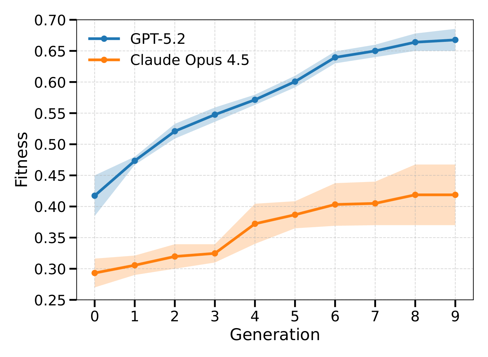](media/max_fitness_gpt_vs_claude.pdf)

The figure shows the maximum population fitness across ten generations for GPT-5.2 and Claude 4.5 Opus.

For each language model, the curve is aggregated across two independent evolutionary runs.

GPT-5.2 consistently produced higher-fitness update rules and reached final-generation fitness values between approximately `0.65` and `0.69`.

Claude 4.5 Opus reached final-generation fitness values between approximately `0.37` and `0.47`.

### Diversity-weight ablation

[Open the diversity-weight ablation PDF](media/ablation_alpha_0_vs_1.pdf)

The crossover coefficient `α` controls the balance between second-parent fitness and source-code dissimilarity.

The main evolutionary runs use:

```math
\alpha = 0.5
```

This intermediate setting achieved higher final fitness than either extreme, indicating that effective crossover benefits from balancing parent quality with structural diversity.

---

## Final benchmark results

The selected algorithms were evaluated on ten Gymnasium environments.

Five environments were used during evolution, while five environments were unseen by the evolutionary fitness process.

All reported values are episodic returns, so **higher is better**, including environments with negative-valued returns.

Results report mean ± standard deviation across five random seeds. For each seed, the checkpoint with the highest evaluation return during training was evaluated over 100 episodes.

| Environment | PPO | A2C | DQN | SAC | CG-FPD | DF-CWP-CP |
|---|---:|---:|---:|---:|---:|---:|
| CartPole ↑ | **500.0 ± 0.0** | **500.0 ± 0.0** | **500.0 ± 0.0** | — | **500.0 ± 0.0** | **500.0 ± 0.0** |
| LunarLander ↑ | 246.6 ± 30.9 | 246.6 ± 13.4 | 250.1 ± 4.1 | — | 241.2 ± 11.0 | **260.6 ± 19.1** |
| MountainCar ↑ | -128.1 ± 44.6 | -134.2 ± 8.7 | -147.8 ± 40.4 | — | **-105.8 ± 10.5** | -108.7 ± 7.3 |
| Acrobot ↑ | -63.5 ± 0.8 | -213.6 ± 202.5 | **-61.9 ± 0.1** | — | -90.6 ± 5.9 | -78.7 ± 8.7 |
| HalfCheetah ↑ | 1579 ± 644 | 796 ± 148 | — | **4989 ± 2668** | 2408 ± 312 | 2104 ± 247 |
| Reacher ↑ | -3.15 ± 0.14 | -6.48 ± 0.57 | — | **-2.05 ± 0.19** | -2.67 ± 0.15 | -5.43 ± 0.44 |
| Swimmer ↑ | 95.0 ± 29.2 | 49.1 ± 1.1 | — | 87.8 ± 23.5 | **247.5 ± 35.5** | 219.8 ± 32.3 |
| InvertedPendulum ↑ | **1000 ± 0** | **1000 ± 0** | — | **1000 ± 0** | **1000 ± 0** | **1000 ± 0** |
| Walker2d ↑ | 3163 ± 397 | 802 ± 291 | — | **4595 ± 252** | 1604 ± 147 | 1298 ± 63 |
| Pusher ↑ | **-25.5 ± 0.3** | -32.4 ± 0.8 | — | **-25.5 ± 0.3** | -27.2 ± 0.9 | -39.9 ± 0.9 |

A dash indicates that an algorithm is not applicable to the corresponding action-space type.

The evolved algorithms achieve competitive performance on the complete ten-environment benchmark suite.

They obtain the strongest reported performance on:

- LunarLander-v3;
- MountainCar-v0;
- Swimmer-v5.

---

## Per-environment learning curves

The first five environments were included in evolutionary fitness.

The remaining five environments were unseen during evolution and were used to assess generalization.

### Environments used during evolution

<table>
<tr>
<td align="center" width="50%">
<a href="media/CartPole-v1.pdf">
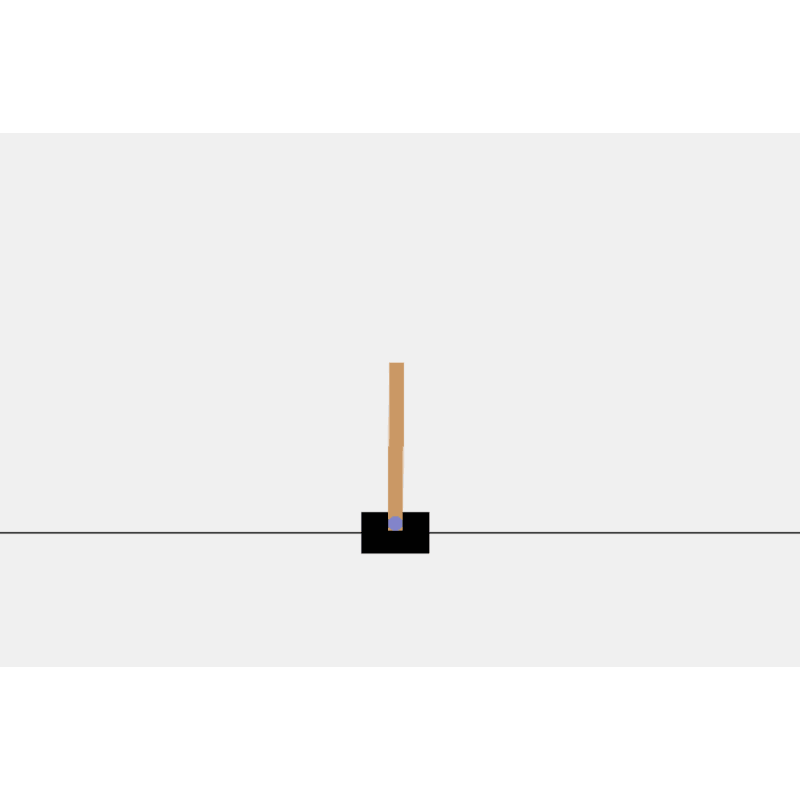
</a>
<br>
<strong>CartPole-v1</strong>
</td>

<td align="center" width="50%">
<a href="media/LunarLander-v3.pdf">
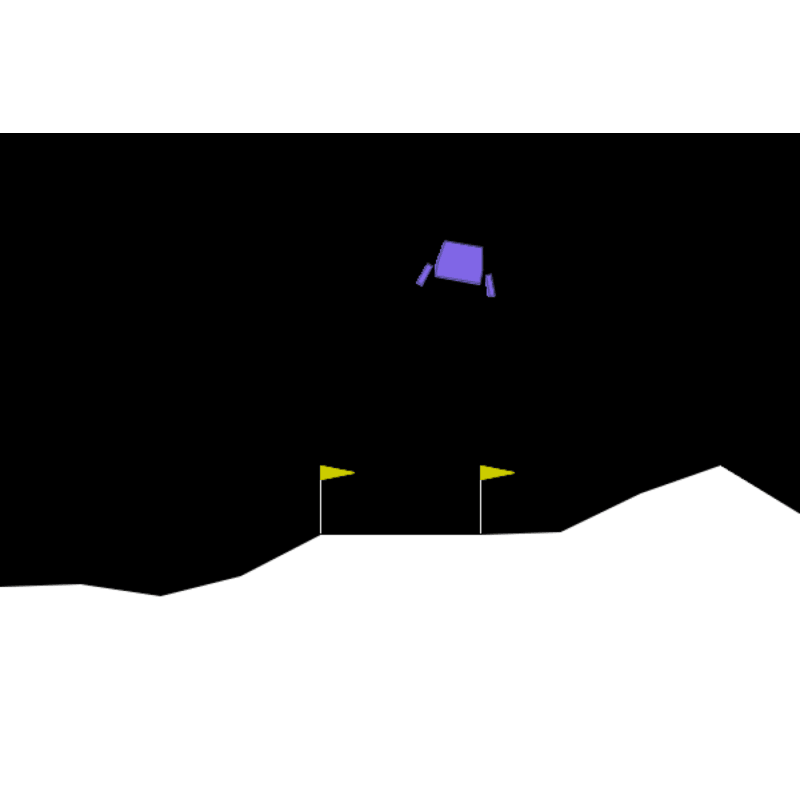
</a>
<br>
<strong>LunarLander-v3</strong>
</td>
</tr>

<tr>
<td align="center">
<a href="media/MountainCar-v0.pdf">
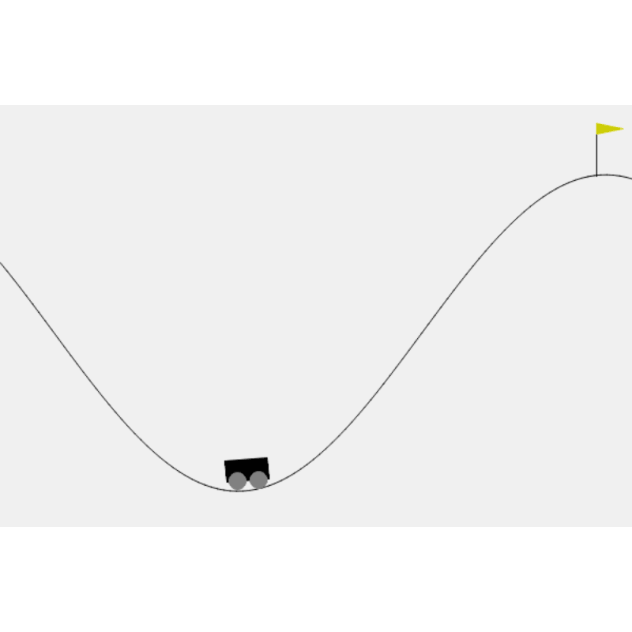
</a>
<br>
<strong>MountainCar-v0</strong>
</td>

<td align="center">
<a href="media/Acrobot-v1.pdf">
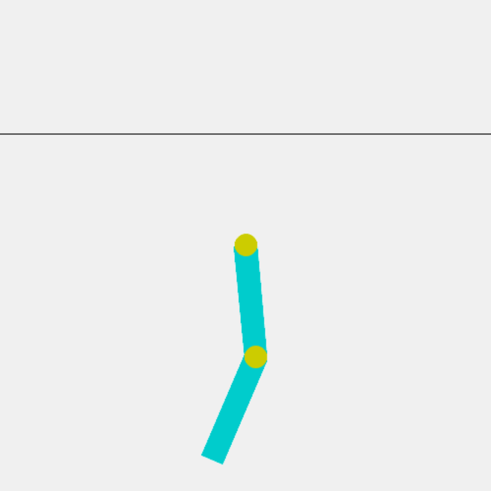
</a>
<br>
<strong>Acrobot-v1</strong>
</td>
</tr>

<tr>
<td align="center" colspan="2">
<a href="media/HalfCheetah-v5.pdf">
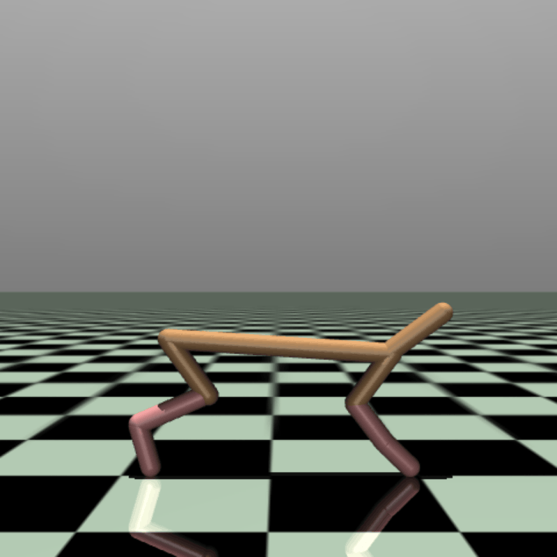
</a>
<br>
<strong>HalfCheetah-v5</strong>
</td>
</tr>
</table>

### Environments unseen during evolution

<table>
<tr>
<td align="center" width="50%">
<a href="media/InvertedPendulum-v5.pdf">
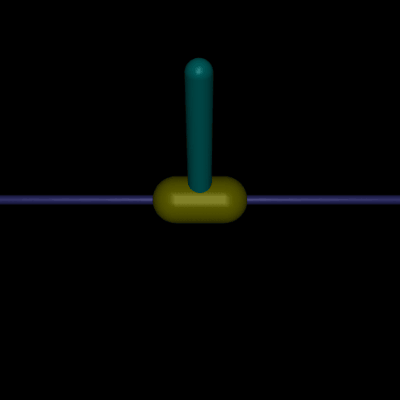
</a>
<br>
<strong>InvertedPendulum-v5</strong>
</td>

<td align="center" width="50%">
<a href="media/Reacher-v5.pdf">
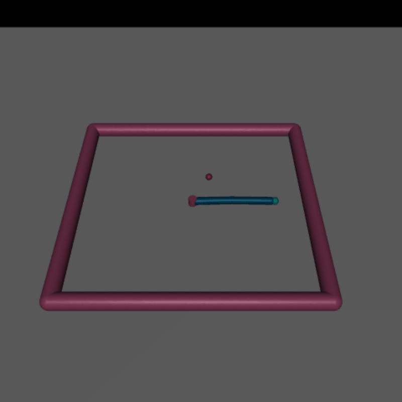
</a>
<br>
<strong>Reacher-v5</strong>
</td>
</tr>

<tr>
<td align="center">
<a href="media/Swimmer-v5.pdf">
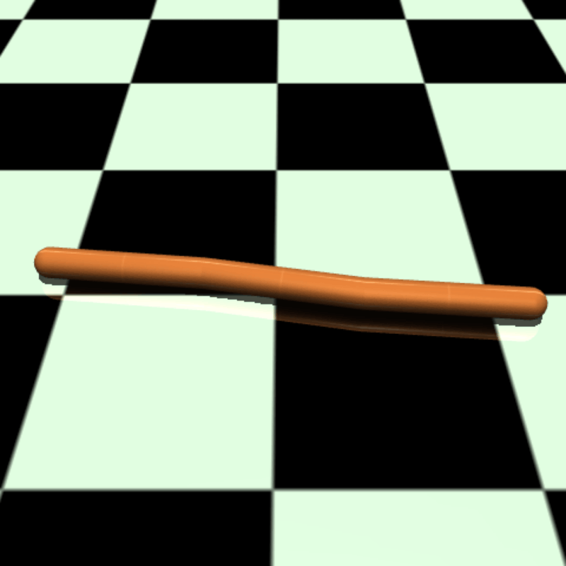
</a>
<br>
<strong>Swimmer-v5</strong>
</td>

<td align="center">
<a href="media/Walker2d-v5.pdf">
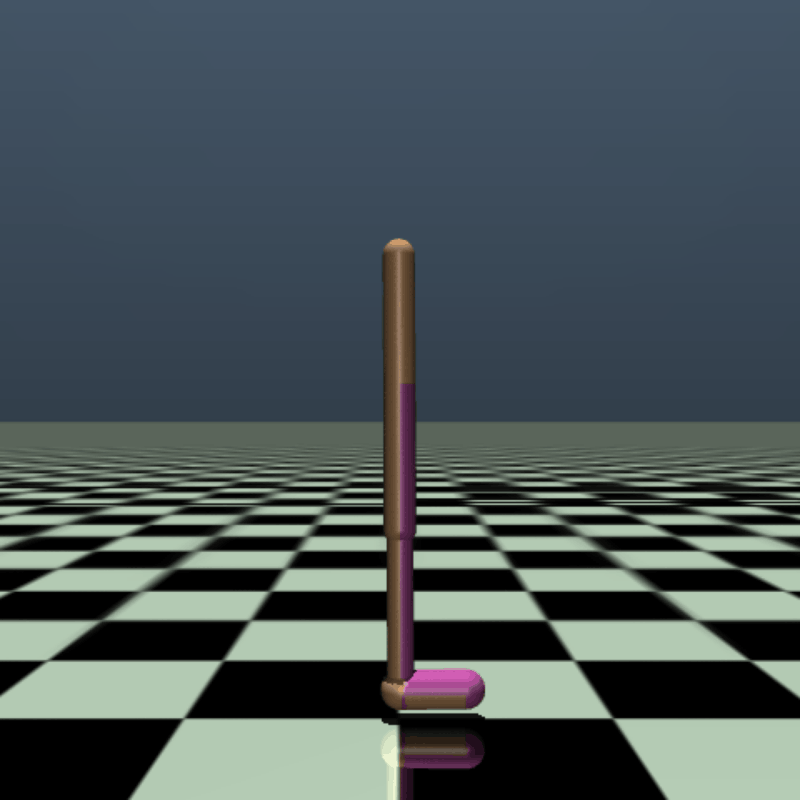
</a>
<br>
<strong>Walker2d-v5</strong>
</td>
</tr>

<tr>
<td align="center" colspan="2">
<a href="media/Pusher-v5.pdf">
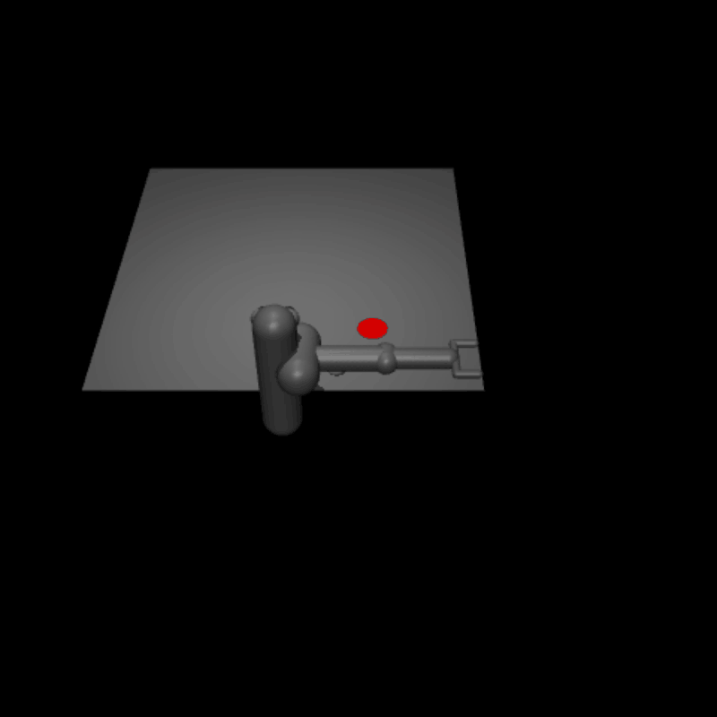
</a>
<br>
<strong>Pusher-v5</strong>
</td>
</tr>
</table>

Click any figure to open its full-resolution PDF.

---

## Installation

Clone the repository:

```bash
git clone https://github.com/sygkounas/Designing-and-Evolving-New-Reinforcement-Learning-Algorithms-using-Large-Language-models.git
cd Designing-and-Evolving-New-Reinforcement-Learning-Algorithms-using-Large-Language-models
```

Create a virtual environment:

```bash
python -m venv .venv
```

Activate the environment on Linux or macOS:

```bash
source .venv/bin/activate
```

Activate the environment on Windows PowerShell:

```powershell
.venv\Scripts\Activate.ps1
```

Upgrade `pip` and install the dependencies:

```bash
python -m pip install --upgrade pip
pip install -r requirements.txt
```

The exact package versions used for the experiments will be specified in `requirements.txt`.

---

## Media files

```text
media/
├── Acrobot-v1-1.png
├── Acrobot-v1.pdf
├── CartPole-v1-1.png
├── CartPole-v1.pdf
├── Designing_and_Evolving_New_Reinforcement_Learning_Algorithms_using_Large_Language_models (4).pdf
├── HalfCheetah-v5-1.png
├── HalfCheetah-v5.pdf
├── InvertedPendulum-v5-1.png
├── InvertedPendulum-v5.pdf
├── LunarLander-v3-1.png
├── LunarLander-v3.pdf
├── MountainCar-v0-1.png
├── MountainCar-v0.pdf
├── Pusher-v5-1.png
├── Pusher-v5.pdf
├── Reacher-v5-1.png
├── Reacher-v5.pdf
├── Swimmer-v5-1.png
├── Swimmer-v5.pdf
├── Walker2d-v5-1.png
├── Walker2d-v5.pdf
├── ablation_alpha_0_vs_1.pdf
├── framework_overview_rl-1.png
├── framework_overview_rl.pdf
├── max_fitness_gpt_vs_claude-1.png
└── max_fitness_gpt_vs_claude.pdf
```

---

## Paper

- [Conference paper PDF](media/Designing_and_Evolving_New_Reinforcement_Learning_Algorithms_using_Large_Language_models%20%284%29.pdf)
- [ACM Digital Library](https://doi.org/10.1145/3795095.3805180)

---

## Citation

If you use this work, please cite:

```bibtex
@inproceedings{sygkounas2026evolutionary,
  title     = {Evolutionary Discovery of Reinforcement Learning Algorithms via Large Language Models},
  author    = {Sygkounas, Alkis and Loutfi, Amy and Persson, Andreas},
  booktitle = {Proceedings of the Genetic and Evolutionary Computation Conference},
  year      = {2026},
  publisher = {Association for Computing Machinery},
  doi       = {10.1145/3795095.3805180}
}
```

This work builds on REvolve:

```bibtex
@inproceedings{hazra2025revolve,
  title     = {{RE}volve: Reward Evolution with Large Language Models using Human Feedback},
  author    = {Hazra, Rishi and Sygkounas, Alkis and Persson, Andreas and Loutfi, Amy and Zuidberg Dos Martires, Pedro},
  booktitle = {The Thirteenth International Conference on Learning Representations},
  year      = {2025},
  url       = {https://openreview.net/forum?id=cJPUpL8mOw}
}
```

---

## Acknowledgements

This work is supported by the Knut and Alice Wallenberg Foundation through the Wallenberg AI, Autonomous Systems and Software Program and the Wallenberg Scholars Grant.

Computational resources were provided by the National Academic Infrastructure for Supercomputing in Sweden through the LUMI supercomputer.
